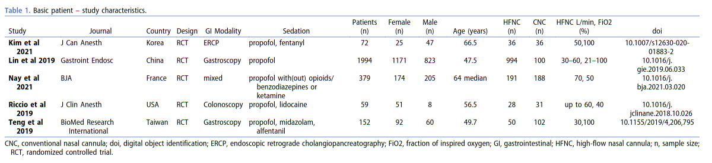
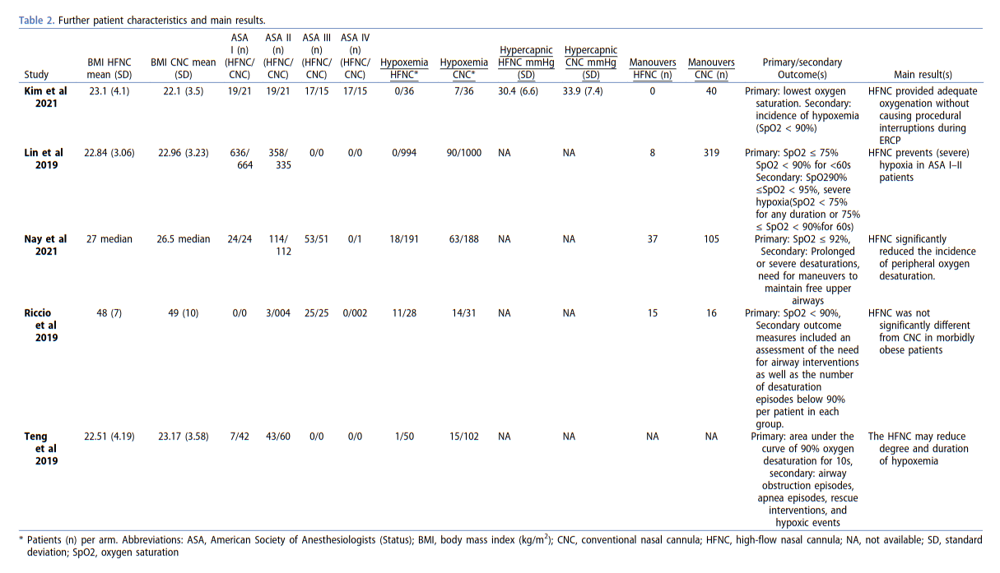

type:: [[paper]]
name:: High-flow versus conventional nasal cannula oxygen supplementation therapy and risk of hypoxia in gastrointestinal endoscopies: a systematic review and meta-analysis
study-type:: [[systematic review]], [[meta analysis]]
author:: Douberis
year:: 2022
tags:: [[deep sedation]], [[HFNC]], [[gastroenterologic procedure]]
country:: [[Switzerland]], [[Greece]]

- 
- só selecionaram 5 RCTs
	- 2656 doentes
	- 
	- 
	-
- menciona os guidelines de segurança da [[ASGE]]
	- AESitGEUT F, Calderwood AH, Chapman FJ, et al. Guidelines for safety in the gastrointestinal endoscopy unit. Gastrointest Endosc.2014;79(3):363–372.
		- [[@asgeensuringsafetyinthegastrointestinalendoscopyunittaskforceGuidelinesSafetyGastrointestinal2014]]
	-
# data collected
# conclusions