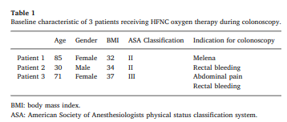

type:: [[paper]]
name:: Use of high-flow nasal cannula in obese patients receiving colonoscopy under intravenous propofol sedation: A case series
study-type:: [[case series]] 
author:: Lee
year:: 2018
tags:: [[obesity]], [[HFNC]], [[gastroenterologic procedure]], [[deep sedation]]

- 
- série de 3 casos
	- 
	- #BMI>30
	- #obesity
		- bom para guia sobre obesidade
# data collected
	- type:: hfnc-data
	  hfnc-flow:: 
	  hfnc-fio2:: 
	  endpoints:: 
	  machine:: 
	  procedure:: [[LGE]] 
	  sedation:: [[propofol]]
# conclusions
	- estudo fraco
	- nao descrevem o protocolo usado para HFNC
	- ((643ead51-8410-4d26-9eab-cb331ea94847))
	-
	-