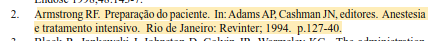
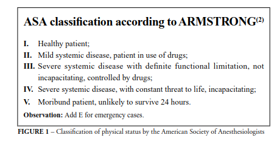

type:: [[paper]]
name:: Predictive factors of oxygen desaturation of patients submitted to endoscopic retrograde cholangiopancreatography under conscious sedation
study-type:: [[transversal study]] 
author:: 
year:: 2004
tags::

- 
- usaram [[midazolam]] e [[petidina]]!
- usam a classificação ASA segundo Armstrong?
	- 
	- 
-
# data collected
# conclusions