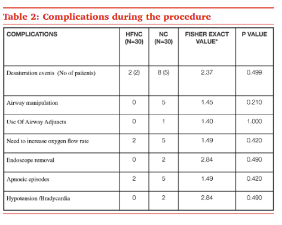

type:: [[paper]]
name:: Comparative evaluation of efficacy of oxygenation using high flow nasal cannula vs. conventional nasal cannula during procedural sedation for endoscopic ultrasound: A pilot study
study-type:: [[RCT]]
author:: Shukla
year:: 2021
tags:: [[deep sedation]], [[gastroenterologic procedure]], [[HFNC]]

- 
- #sedation_protocol
	- ((643ebcc0-0dfc-489e-bf16-6c44c75dbd84))
- #study_population
	- 30 doentes em cada grupo
	- usaram #BIS
	- jovens com BMI baixo
# data collected
	- type:: hfnc-data
	  hfnc-flow:: 60
	  hfnc-fio2:: 40
	  endpoints:: [[hypoxemia]] 
	  machine:: [[AIRVO2]] 
	  procedure:: [[EUS]] 
	  sedation:: [[propofol]], [[fentanil]]
# conclusions
	- ((643ebc81-2e90-4f53-acfc-21047c196858))
	- apesar disso, há claramente uma tendencia para ser melhor com HFNC
		- tem poucos doentes, por isso nao deu diferença
		- 
-