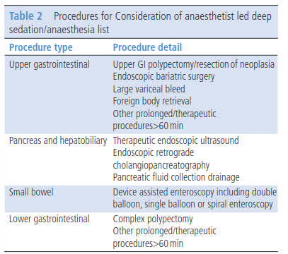

type:: [[paper]]
name:: Deep sedation and anaesthesia in complex gastrointestinal endoscopy: a joint position statement endorsed by the British Society of Gastroenterology (BSG), Joint Advisory Group (JAG) and Royal College of Anaesthetists (RCoA)
study-type:: [[review]], [[guidelines]], [[position statement]] 
author:: Sidhu
year:: 2019
tags:: [[deep sedation]], [[gastroenterologic procedure]]
title:: @sidhuDeepSedationAnaesthesia2019

- 
- # recomendações
	- [[TCI]] e [[BIS]]
		- ((6440f9f2-a220-42b5-b29e-80e817162112))
		- ((6440f9ff-ef72-4f81-a082-6d56b7ca586c))
	- [[HFNC]]
		- ((6440f9f8-12c5-4893-b149-57cb00cebc7a))
		- ((6440facd-281a-495b-8541-0826c3e21617))
	- fala dos #custos
		- ((6440fa4a-7514-40e4-9aa9-2c4f519fb4b5))
- fala dos [[complex gastroenterologic procedures]]
	- 
- [[modified STOP-BANG screening cheklist for OSA]]
	- ((64457fdf-35cf-4163-bb10-71b72487577a))
-
-
# conclusions
	- ((6440f622-8285-42da-b685-3386803fb752))
- appendix 1
	- 
-