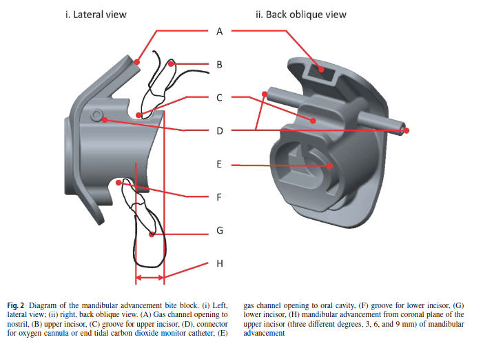

type:: [[paper]]
name:: Novel mandibular advancement bite block with supplemental oxygen to both nasal and oral cavity improves oxygenation during esophagogastroduodenoscopy: a bench comparison
study-type:: [[comparative study]]
author:: Teng
year:: 2019
tags:: [[gastroenterologic procedure]]

- 
- descrevem o desenvolvimento de um [[bite block]] desenhado para manter a via aerea patente e permitir administrar oxigénio durante [[UGE]], [[bronchoscopy]] e [[TEE]]
- 
-
-
# data collected
# conclusions