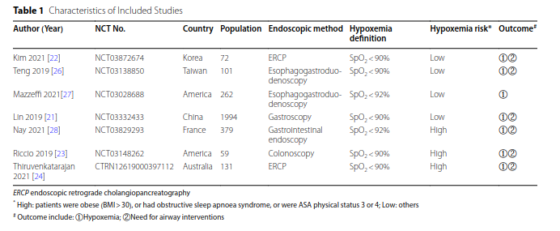

type:: [[paper]]
name:: The effectiveness of high-flow nasal cannula during sedated digestive endoscopy: a systematic review and meta-analysis
study-type:: [[meta analysis]] 
author:: Zhang 
year:: 2022
tags:: [[HFNC]], [[deep sedation]], [[gastroenterologic procedure]]

- 
- #mortality
	- ((643e7f11-43f7-48cd-813b-331c2e5e8c64))
- tem uma tabela interessante com 2 outcomes #hypoxemia e [[need for airway intervention]]
	- 
-
# data collected
	-
# conclusions
	- ((643e7ec3-0dbe-4b9d-8257-c6cba776b660))
	- sugere que pode não ser tão eficaz em doentes de [[patients at risk of hypoxemia]] elevado
-