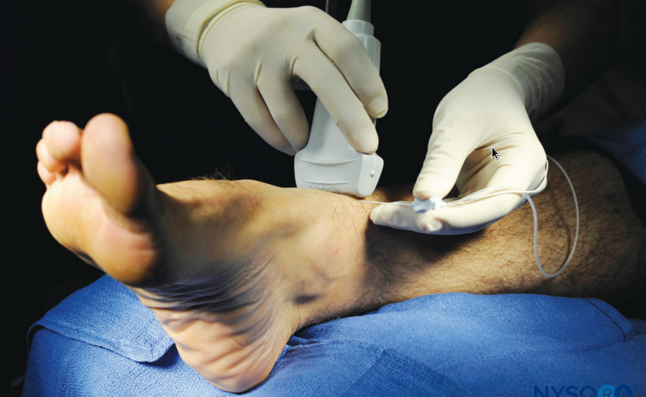

tags:: [[regional anesthesia]], [[lower limb]]

- bloqueio para cirurgia de [[joanetes]]
	- {{video https://www.youtube.com/watch?v=a-gBj_-EHPs}}
	- não é preciso bloquear o [[nervo safeno]]
	- primeiro bloquear o [[posterior tibial nerve]]
		- procurar a [[posterior tibial artery]]
		- colocar a sonda acima do maleolo medial
			- 
		- 3-5 mL ropi a 5
	- segundo bloquer o [[deep peroneal nerve]]
		- colocar a sonda acima do maleolo medial na face anterior da perna
			- 
		- procurar a [[anterior tibial artery]]
		-
	- terceiro bloquear o [[superficial peroneal nerve]]
	-